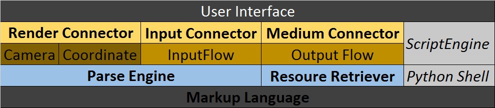

# Meta Game Engine

### Intro

A simple game engine developed on Qt library, together with python script engine powered.

> 一种戏剧的表现方式：The Scene story developed together with Background Music formed, and then spend the time on the visual representation.

### Principle

设计理念：

​	为代码风格，用散文一样的风格写游戏；

​	分离资源、场景、精灵脚本的描述，与**演出**的描述，游戏开发者只需要描述演出，即游戏世界的逻辑；这种快捷的开发，当然需要引擎开发参与者，提供广泛的，高度可定制的模块、插件、封装，以及模型、资源、行为脚本等。

游戏是一种融合演员与观众角色的Play，所以游戏引擎不是Player，Render，不仅仅包含Camera，Scene，Spirit (Character)，Script and etc. 玩家的**选择与参与**是游戏这门艺术的精华 。

将游戏的整个过程看为两个部分：（1）交互[connector]（2）游戏世界[logic]

1. 对于**世界**的部分，属于引擎的核心，即：**游戏世界的存在与玩家的无关性**；在此基础上，运用**Markup Language**对于世界进行描述，包括：Timeline{Timestamp, UID, Condition}, Scene{UID, Light, Decoration, BGM}，Spirit{UID, movement, words, interacts (scripts)}；引擎在这里提供**欧式空间**以及**经典物理空间**的限定，对世界描述的Normalize，在此基础上建立对**世界描述**进行**变换**(Transmute)；同时，世界描述的演变(Timestamp)，由connector的事件进行驱动；

   注：这里的变换并非指通过connector的向physical world的output，而是状态的推移，指通过全局Timeline ID的改变，指定当前世界的行为索引(index)，最终的渲染由connector决定

2. 对于**交互**的部分，包含Camera与Coordinate，输入输出流Buffer，以及最为重要的**渲染引擎**；在这里，要真正的加载描述的**资源信息**，获取用户端的输入，并根据**最终描述**以及**用户输入**，确定Camera的拍摄方式以及特效（摄影分镜），以及Coordinate的变换；Script Engine作为用户输入的辅助，通过python shell的支持，对底层描述进行改写；

   注：这里的python shell经过底层描述(Markup)的定制，只能完成被限制的script操作

当前系统设计如下图所示：

### Developing Process

首先，是一个播放器；图片，声音，视频，是一个抽象输入流控制的播放器（酷炫shell交互std输出）

然后，是一个有着**有限**原生系统API调用的，有输入控制的播放器（文件读写，动态库加载等）

（TBC.）

